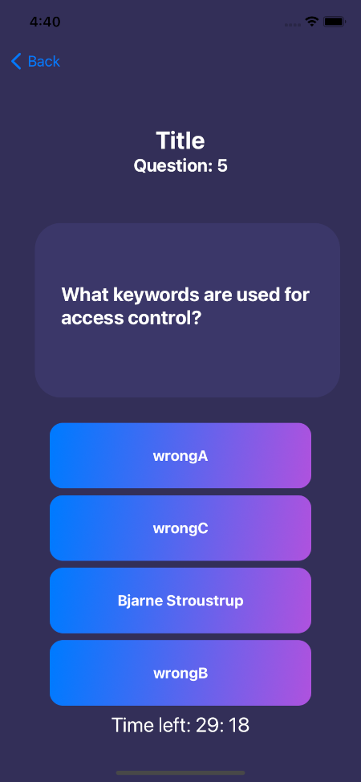

# RocketQuiz

## A quiz application where user can check their performance on different technologies like Java, iOS , Swift, Android etc.

This is a SwiftUI that app quizzes users and persistantly stores their quiz performance and ranks them based on average scores across multiple quizzes. Users can sign in with facebook.

## Technologies Used

* Core Data
* SwiftUI
* UIKit

## Features

* Randomizes order of questions and answers on every quiz. Pulls questions randomly from question bank.
* Allows user to sign in with facebook
* Ranks users based on average score across multiple quizzes

To-do list:
* Add category sections in quiz
* Allow Questions to be read into the question bank from a CSV file

## Getting Started

Use  `git clone https://github.com/KirtlandRoss/RocketQuiz` in an initialized git repository
Open `TechnologyQuizApp.xcworkspace` in the repository with XCode 12 or later

In the top right under ResortFeedbackApp scheme and then iPhone 11, then hit the play button or `CMD` + `R`/ `WINDOWS` + `R` on the keyboard

## Usage

This project can be used to quiz multiple users on multiple different questions with a randomized questions from a persistant question bank.

## License

This project uses the following license: [MIT Licence](https://github.com/KirtlandRoss/RocketQuiz/blob/main/LICENSE).
